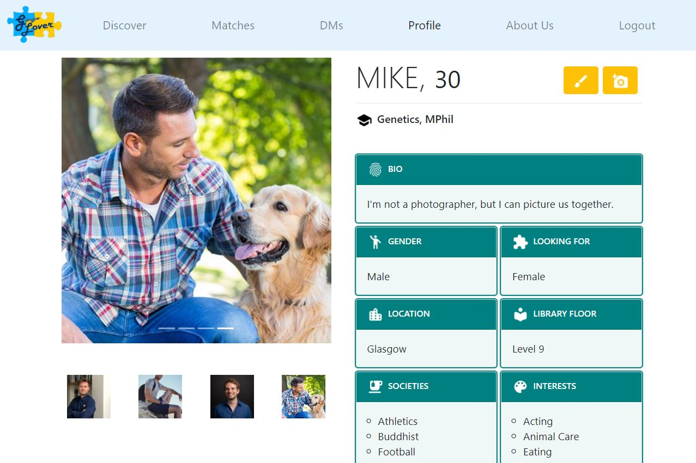

# GLover - dating site for University of Glasgow students
### Year 2 Web Application Development group project

A silly Django project which lets University of Glasgow students connect based on each person's preferences, interests, societies, etc.

### Profile Page

### Discover Page

### Direct Messages Page

#### Environment setup
`mkvirtualenv glover`
`pip install -r requirements.txt`  
`workon glover`

#### Populating the database
Run this script to get a better feel for what's the site like!
`python population_script.py`

#### Running tests
`python manage.py test`